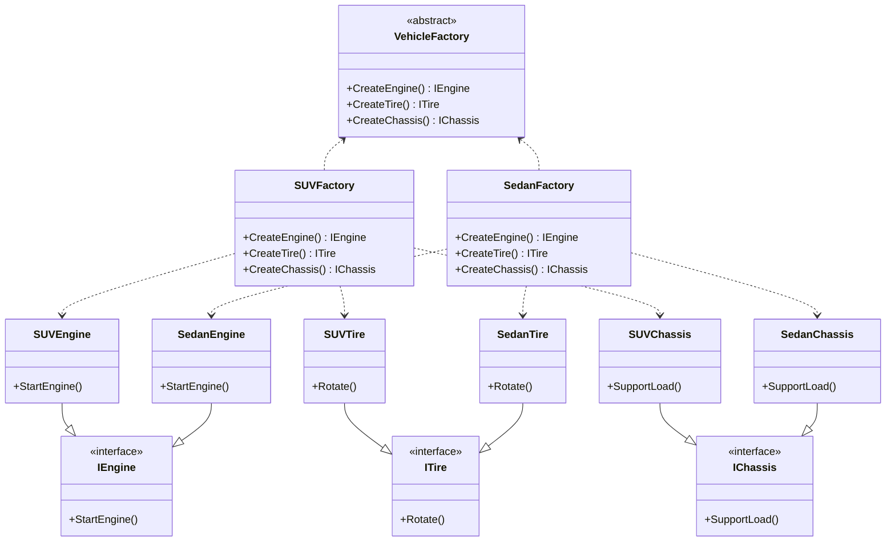

# Abstract Factory Design Pattern

## Purpose
Abstract Factory is a creational design pattern, which solves the problem of creating entire product families without specifying their concrete classes.

## Steps
1. Establish a unique interface for each product within a product family.  
2. Develop specific implementations for each variation of product using the product interface.  
3. Define an abstract factory containing creation methods for all abstract products.  
4. Create concrete factory classes, each corresponding to a specific product variant, and ensure they produce only those variants.  

## Example
A vehicle manufacturing company uses the Abstract Factory pattern to create families of components—such as engines, tires, and chassis—tailored for specific vehicle types like SUVs, sedans and trucks ensuring consistency within each vehicle variant.

## Cons
- If a product in family doesn't have a specific variation to implement then code may lead to redundant or irrelevant implementations.
- Adding a new product to the family requires changes to the abstract factory interface and all its concrete implementations, which voilates OCP.

## Structure


## Code
```csharp
using System;

// Abstract Products
interface IEngine
{
    void StartEngine();
}

interface ITire
{
    void Rotate();
}

interface IChassis
{
    void SupportLoad();
}

// Concrete Products for SUV
class SUVEngine : IEngine
{
    public void StartEngine() => Console.WriteLine("Starting SUV engine...");
}

class SUVTire : ITire
{
    public void Rotate() => Console.WriteLine("SUV tires are rotating...");
}

class SUVChassis : IChassis
{
    public void SupportLoad() => Console.WriteLine("SUV chassis supporting heavy load...");
}

// Concrete Products for Sedan
class SedanEngine : IEngine
{
    public void StartEngine() => Console.WriteLine("Starting Sedan engine...");
}

class SedanTire : ITire
{
    public void Rotate() => Console.WriteLine("Sedan tires are rotating...");
}

class SedanChassis : IChassis
{
    public void SupportLoad() => Console.WriteLine("Sedan chassis supporting light load...");
}

// Abstract Factory
abstract class VehicleFactory
{
    public abstract IEngine CreateEngine();
    public abstract ITire CreateTire();
    public abstract IChassis CreateChassis();
}

// Concrete Factories
class SUVFactory : VehicleFactory
{
    public override IEngine CreateEngine() => new SUVEngine();
    public override ITire CreateTire() => new SUVTire();
    public override IChassis CreateChassis() => new SUVChassis();
}

class SedanFactory : VehicleFactory
{
    public override IEngine CreateEngine() => new SedanEngine();
    public override ITire CreateTire() => new SedanTire();
    public override IChassis CreateChassis() => new SedanChassis();
}

// Client
class VehicleAssembler
{
    private readonly IEngine _engine;
    private readonly ITire _tire;
    private readonly IChassis _chassis;

    public VehicleAssembler(VehicleFactory factory)
    {
        _engine = factory.CreateEngine();
        _tire = factory.CreateTire();
        _chassis = factory.CreateChassis();
    }

    public void AssembleAndTestVehicle()
    {
        Console.WriteLine("Assembling and Testing Vehicle:");
        _engine.StartEngine();
        _tire.Rotate();
        _chassis.SupportLoad();
    }
}

// Main
class Program
{
    static void Main(string[] args)
    {
        Console.WriteLine("Producing SUV:");
        VehicleFactory suvFactory = new SUVFactory();
        var suvAssembler = new VehicleAssembler(suvFactory);
        suvAssembler.AssembleAndTestVehicle();

        Console.WriteLine("\nProducing Sedan:");
        VehicleFactory sedanFactory = new SedanFactory();
        var sedanAssembler = new VehicleAssembler(sedanFactory);
        sedanAssembler.AssembleAndTestVehicle();
    }
}
```