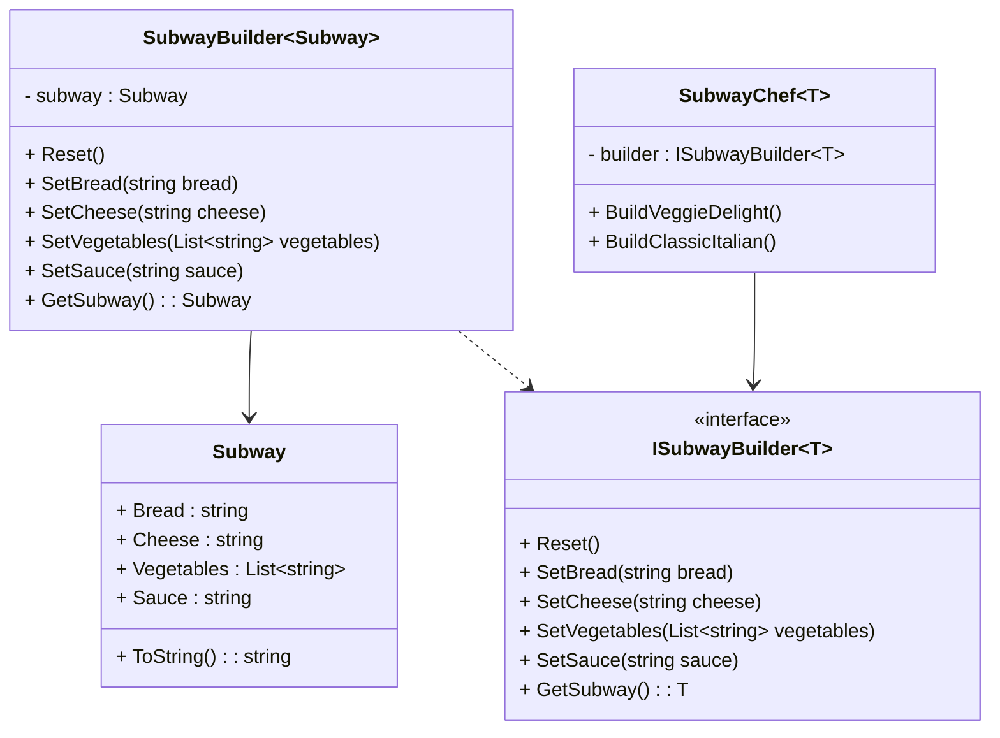

# Builder Design Pattern

## Purpose
Builder is a creational design pattern that helps construct complex objects step by step to produce products of different types.

## Steps
1. Define one or more product classes. *(No need for common interface for them)*
2. Design a builder interface with common construction steps, supporting a generic type, and including methods for `Reset` & `GetProduct`.
3. Create a concrete builder class by inheriting builder interface for each of the product representations & implement their construction steps.
4. Implement a director class using a builder interface to manage construction order for different configurations.

## Example
A fast food app would like subway will have lots of customisation options & few predefined menu which makes building process complex. Builder design pattern can be used with products being Order, Recipe, Bill their respective builders and a director class mentioning predefined menu methods.

## Cons
- Builder design pattern does not provide facility to undo a construction step, you need to reset and start from beginning
- The overall complexity of the code increases since the pattern requires creating multiple new classes.

## Structure


## Code
```csharp
// Product
public class Subway
{
    public string Bread { get; set; }
    public string Cheese { get; set; }
    public List<string> Vegetables { get; set; } = new();
    public string Sauce { get; set; }

    public override string ToString()
    {
        return $"Subway with {Bread} bread, {Cheese} cheese, ({string.Join(", ", Vegetables)}) vegetables and {Sauce} sauce.";
    }
}

// Builder Interface
public interface ISubwayBuilder<T>
{
    void Reset();
    void SetBread(string bread);
    void SetCheese(string cheese);
    void AddVegetables(List<string> vegetables);
    void SetSauce(string sauce);
    T GetSubway();
}

// Concrete Builder
public class SubwayBuilder : ISubwayBuilder<Subway>
{
    private Subway _subway = new();

    public void Reset()
    {
        _subway = new Subway();
    }

    public void SetBread(string bread)
    {
        _subway.Bread = bread;
    }

    public void SetCheese(string cheese)
    {
        _subway.Cheese = cheese;
    }

    public void AddVegetables(List<string> vegetables)
    {
        _subway.Vegetables.AddRange(vegetables);
    }

    public void SetSauce(string sauce)
    {
        _subway.Sauce = sauce;
    }

    public Subway GetSubway()
    {
        var result = _subway;
        Reset();
        return result;
    }
}

// Director
public class SubwayChef<T>
{
    private readonly ISubwayBuilder<T> _builder;

    public SubwayChef(ISubwayBuilder<T> builder)
    {
        _builder = builder;
    }

    public void BuildVeggieDelight()
    {
        _builder.SetBread("Multigrain");
        _builder.SetCheese("Cheddar");
        _builder.AddVegetables(new List<string> { "Lettuce", "Tomato", "Cucumber", "Onions" });
        _builder.SetSauce("Mayonnaise");
    }

    public void BuildClassicItalian()
    {
        _builder.SetBread("Italian");
        _builder.SetCheese("Mozzarella");
        _builder.AddVegetables(new List<string> { "Lettuce", "Green Peppers" });
        _builder.SetSauce("Marinara");
    }
}

// Client
class Program
{
    static void Main(string[] args)
    {
        ISubwayBuilder<Subway> builder = new SubwayBuilder();
        SubwayChef<Subway> chef = new(builder);

        // Build a Veggie Delight Subway
        chef.BuildVeggieDelight();
        Subway veggieDelight = builder.GetSubway();
        Console.WriteLine(veggieDelight);

        // Build a Classic Italian Subway
        chef.BuildClassicItalian();
        Subway classicItalian = builder.GetSubway();
        Console.WriteLine(classicItalian);
    }
}
```