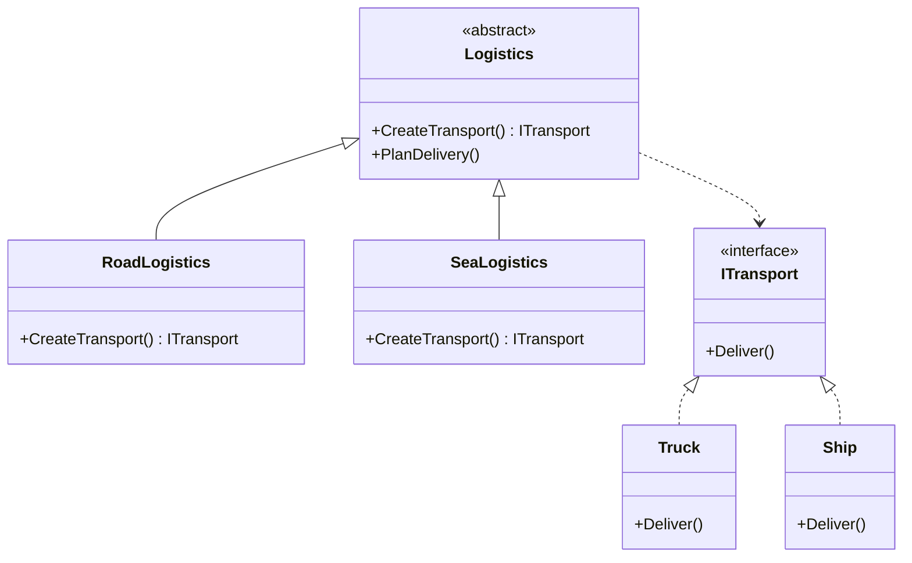

# Factory Method Design Pattern

## Purpose
Factory Method is a creational design pattern that provides an interface for creating objects in a superclass, but allows subclasses to alter the type of objects that will be created.

## Steps
1. Define a product interface that outlines common functionalities.
2. Implement concrete product classes that inherit from the product interface.
3. Develop an abstract factory class with an abstract factory method that returns a product interface.
4. Implement concrete factory classes that override the factory method to create product instances.

## Example
Google Docs provides the ability to create, open, edit different types of documents such as text documents, spreadsheets, and presentations. Each document type has unique creation logic, behavior and functionality.

## Cons
- The code may become more complicated since you need to introduce a lot of new subclasses to implement the pattern.
For example, imagine abstract Mail class has subclasses: AirMail and GroundMail; the Transport product classes are Plane, Truck and Train. While the AirMail class only uses Plane objects, GroundMail may work with both Truck and Train objects.

## Structure


## Code
```csharp
abstract class Logistics
{
    public abstract ITransport CreateTransport();

    public string PlanDelivery()
    {
        Console.WriteLine("Deliver at weekends");
    }
}

class RoadLogistics : Logistics
{
    public override ITransport CreateTransport()
    {
        return new Truck();
    }
}

class SeaLogistics : Logistics
{
    public override ITransport CreateTransport()
    {
        return new Ship();
    }
}

public interface ITransport
{
    string Deliver();
}

class Truck : ITransport
{
    public string Deliver()
    {
        return "Deliver by Truck";
    }
}

class Ship : ITransport
{
    public string Deliver()
    {
        return "Deliver by Ship";
    }
}

class Program
{
    public static void Main()
    {
        Console.WriteLine("RoadLogistics");
        Logistics logistics = new RoadLogistics();
        logistics.PlanDelivery();
        ITransport transport = logistics.CreateTransport();
        transport.Deliver();

        Console.WriteLine("SeaLogistics");
        logistics = new SeaLogistics();
        logistics.PlanDelivery();
        transport = logistics.CreateTransport();
        transport.Deliver();
    }
}
```
