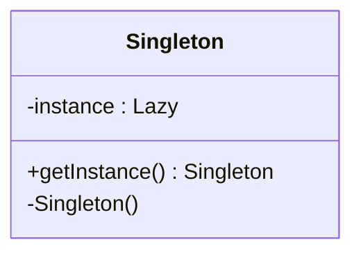

# Singleton Design Pattern

## Purpose
Singleton is a creational design pattern that lets you ensure that a class has only one instance, while providing a global access point to this instance.

## Steps
1. Mark class as sealed
2. Mark constructor as private
3. Declare and initialize a private, static, readonly Lazy<T> variable with a lambda function to create the singleton instance.
4. Create a public property to access the instance value *(Do not provide set access)*

## Example
**Real World:** A country typically has one centralized government that governs and makes decisions for the entire nation.
**Technical:** A file System Manager handles access to files and directories in a coordinated manner.

## Cons
- Constructor preferred parameterless, since different parameter values leads to different object types/values
- Difficult to unit test the client code of the Singleton because many test frameworks rely on inheritance when producing mock objects.

## Structure


## Code
```csharp
public sealed class Singleton
{
    private static readonly Lazy<Singleton> lazy = new Lazy<Singleton>(() => new Singleton());

    public static Singleton Instance
    {
      get
      {
        return lazy.Value;
      }
    }

    private Singleton() { }
}
```
