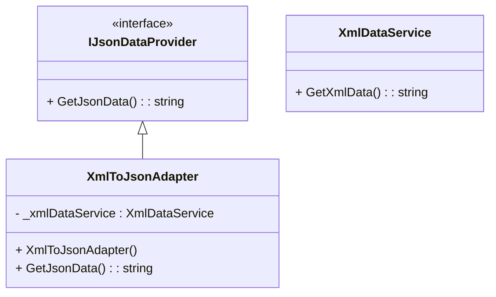

# Adapter Design Pattern

## Purpose
Adapter is a structural design pattern, which allows incompatible objects/systems to collaborate.

## Steps
1. Create a legacy service class with method working using new format
2. Create a modern client interface with method working using old format
3. Create an adapter class which interits modern client interface & uses object of legacy service class
4. The adapter class should have a method which consumes method(data) of legacy class, further translate & return in modern form

## Example
Different countries follow differnt standards for sockets of electrical appliances. So while traveling international, using adapter can help make plug and socket compatible.

## Cons
- Since the adapter pattern introduces an additional layer, there might be a slight performance overhead, noticable in high performance systems.

## Structure


## Code
```csharp
public interface IJsonDataProvider
{
	string GetJsonData();
}

public class XmlDataService
{
	public string GetXmlData()
	{
		return "<person><name>John Doe</name><age>30</age></person>";
	}
}

public class XmlToJsonAdapter : IJsonDataProvider
{
	private readonly XmlDataService _xmlDataService;

	public XmlToJsonAdapter(XmlDataService xmlDataService)
	{
		_xmlDataService = xmlDataService;
	}

	public string GetJsonData()
	{
		string xmlData = _xmlDataService.GetXmlData();

		XmlDocument xmlDoc = new XmlDocument();
		xmlDoc.LoadXml(xmlData);

		string jsonData = JsonConvert.SerializeXmlNode(xmlDoc, Formatting.Indented, true);

		return jsonData;
	}
}
```
