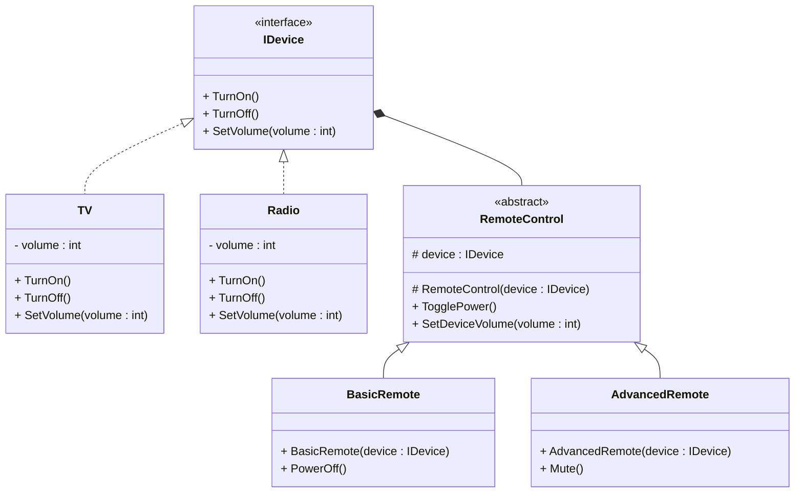

# Bridge Design Pattern

## Purpose
Bridge is a structural design pattern that divides business logic or huge class into separate class hierarchies that can be developed independently.

## Steps
1. Create an interface which is represents being controlled
2. Create concrete classes which inherit this interface
3. Create abstract class which represents as controller where constructor accepts above interface & store in protected object.
4. Create concrete classes which inherits abstract class whose methods calls point 2 methods

## Example
The Bridge pattern can help divide the monolithic code of an app that manages devices and their remote controls. The Device classes act as the implementation, whereas the Remotes act as the abstraction.

## Cons
- Increased Complexity – More classes and interfaces than a simple inheritance approach.

## Structure


## Code
```csharp
public interface IDevice
{
    void TurnOn();
    void TurnOff();
    void SetVolume(int volume);
}

public class TV : IDevice
{
    private int volume = 10;
    
    public void TurnOn() => Console.WriteLine("TV is now ON.");
    public void TurnOff() => Console.WriteLine("TV is now OFF.");
    public void SetVolume(int volume)
    {
        this.volume = volume;
        Console.WriteLine($"TV volume set to {volume}.");
    }
}

public class Radio : IDevice
{
    private int volume = 5;
    
    public void TurnOn() => Console.WriteLine("Radio is now ON.");
    public void TurnOff() => Console.WriteLine("Radio is now OFF.");
    public void SetVolume(int volume)
    {
        this.volume = volume;
        Console.WriteLine($"Radio volume set to {volume}.");
    }
}

public abstract class RemoteControl
{
    protected IDevice device;

    protected RemoteControl(IDevice device)
    {
        this.device = device;
    }

    public void TogglePower()
    {
        Console.WriteLine("Toggling power...");
        device.TurnOn();
    }

    public void SetDeviceVolume(int volume)
    {
        device.SetVolume(volume);
    }
}

public class BasicRemote : RemoteControl
{
    public BasicRemote(IDevice device) : base(device) { }

    public void PowerOff()
    {
        Console.WriteLine("Basic Remote: Turning off device.");
        device.TurnOff();
    }
}

public class AdvancedRemote : RemoteControl
{
    public AdvancedRemote(IDevice device) : base(device) { }

    public void Mute()
    {
        Console.WriteLine("Advanced Remote: Muting the device.");
        device.SetVolume(0);
    }
}
```