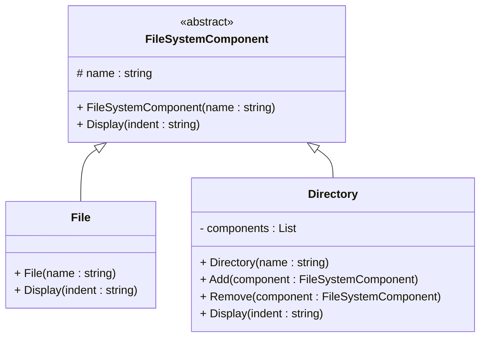

# Composite Design Pattern

## Purpose
Composite is a structural design pattern that lets you compose objects into tree structures and then work with these structures as if they were individual objects.

## Steps
1. Declare the component abstract class with a list of methods common for both simple and complex components.
2. Create a leaf class inheriting component class to represent simple elements. A program may have multiple different leaf classes.
3. Create a container class inheriting component class which has an array of component interface holding left/container object.
4. Client should work/communicate this component abstract class

## Example
The Composite Design Pattern allows us to represent files and directories in a hierarchical structure, where both can be treated uniformly using a common interface, enabling recursive operations like displaying the file system details.

## Cons
- In certain scenarios, you’d need to overgeneralize the component interface, making it harder to comprehend and voilating Interface Segregation Principle

## Structure


## Code
```csharp
// Component
public abstract class FileSystemComponent
{
    protected string name;

    public FileSystemComponent(string name)
    {
        this.name = name;
    }

    public abstract void Display(string indent);
}

// Leaf
public class File : FileSystemComponent
{
    public File(string name) : base(name) { }

    public override void Display(string indent)
    {
        Console.WriteLine(indent + "- " + name);
    }
}

// Composite
public class Directory : FileSystemComponent
{
    private List<FileSystemComponent> components = new List<FileSystemComponent>();

    public Directory(string name) : base(name) { }

    public void Add(FileSystemComponent component)
    {
        components.Add(component);
    }

    public void Remove(FileSystemComponent component)
    {
        components.Remove(component);
    }

    public override void Display(string indent)
    {
        Console.WriteLine(indent + "+ " + name);
        foreach (var component in components)
        {
            component.Display(indent + "  ");
        }
    }
}
```