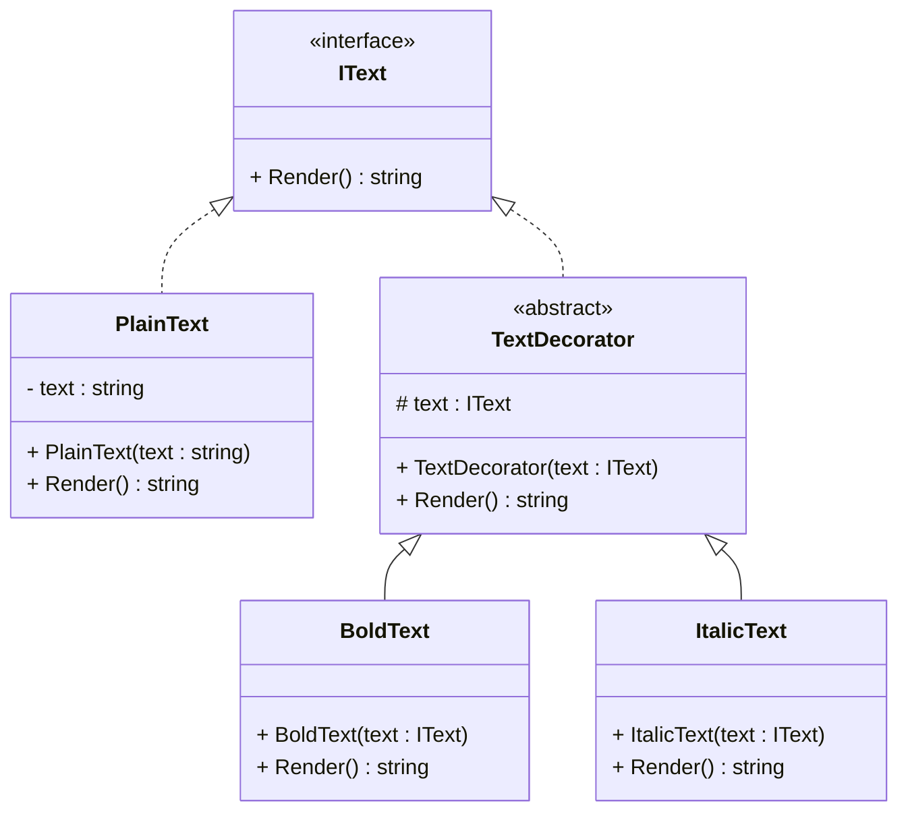

# Decorator Design Pattern

## Purpose
Decorator is a structural design pattern that lets you attach new behaviors to objects by placing these objects inside special wrapper objects that contain the behaviors.

## Steps
1. Create a component interface with common methods containing action for a behavior
2. Implement a concrete class inherting component interface that provides the default behavior.
3. Create an base decorator abstract class inheriting component interface, it also accepts interface & delegates requests to wrapped objects.
4. Create concrete decorators by extending them from the base decorator. A concrete decorator must execute its behavior before or after the call to the parent method. 


## Example
Decorator desing pattern can be used in text editor which allows you to apply different formatting options (bold, italic, underline) dynamically.

## Cons
- It’s hard to implement a decorator in such a way that its behavior doesn’t depend on the order in the decorators stack.

## Structure


## Code
```csharp
public interface IText
{
    string Render();
}

public class PlainText : IText
{
    private string text;

    public PlainText(string text) => this.text = text;
    public string Render() => text;
}

public abstract class TextDecorator : IText
{
    protected IText text;
    public TextDecorator(IText text) => this.text = text;
    public abstract string Render();
}

public class BoldText : TextDecorator
{
    public BoldText(IText text) : base(text) { }
    public override string Render() => "<b>" + base.Render() + "</b>";
}

public class ItalicText : TextDecorator
{
    public ItalicText(IText text) : base(text) { }
    public override string Render() => "<i>" + base.Render() + "</i>";
}
```