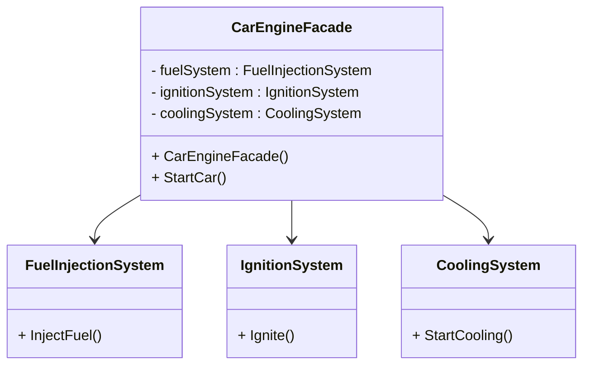

# Facade Design Pattern

## Purpose
Facade is a structural design pattern that provides a simplified (but limited) interface to a complex system of classes, library or framework.

## Steps
1. Create a facade class which acts as interface providing limited functionaility of a large subsystem classes
2. The facade should redirect the calls from the client code to appropriate objects of the subsystem. 
3. If needed you can create multiple facade classes, if bloated

## Example
A car has a start button which acts as facade which handles subsystems: like fuel injection, ignition system, cooling system, etc.

## Cons
- Clients interacting only through the Facade may lose access to advanced functionalities provided by individual subsystem components.

## Structure


## Code
```csharp
using System;

namespace FacadePattern
{
    // Subsystem 1: Fuel Injection System
    class FuelInjectionSystem
    {
        public void InjectFuel() => Console.WriteLine("Fuel injected into the engine.");
    }

    // Subsystem 2: Ignition System
    class IgnitionSystem
    {
        public void Ignite() => Console.WriteLine("Ignition started, engine is running.");
    }

    // Subsystem 3: Cooling System
    class CoolingSystem
    {
        public void StartCooling() => Console.WriteLine("Cooling system activated.");
    }

    // Facade Class: Car Engine Management
    class CarEngineFacade
    {
        private FuelInjectionSystem fuelSystem;
        private IgnitionSystem ignitionSystem;
        private CoolingSystem coolingSystem;

        public CarEngineFacade()
        {
            fuelSystem = new FuelInjectionSystem();
            ignitionSystem = new IgnitionSystem();
            coolingSystem = new CoolingSystem();
        }

        public void StartCar()
        {
            Console.WriteLine("Starting car...");
            fuelSystem.InjectFuel();
            ignitionSystem.Ignite();
            coolingSystem.StartCooling();
            Console.WriteLine("Car started successfully!");
        }
    }
}
```