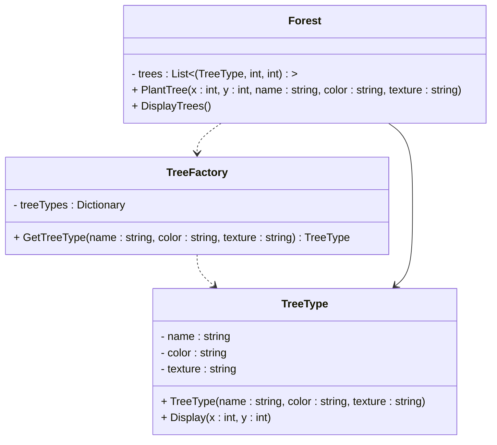

# Flyweight Design Pattern

## Purpose
Flyweight is a structural design pattern that lets you fit more objects into the available amount of RAM by sharing common parts of state between multiple objects instead of keeping all of the data in each object.

## Steps
1. Create a Flyweight class that defines common properties & mehid accepting changing data.
2. Create extrinsic classes holding chaning values, reference to flyweight class & calling their method.
3. Create a Flyweight Factory to return existing instances else create & store.

## Example
In a chess game, each piece (pawn, rook, knight) has common properties like type, movement rules, etc. Instead of creating a new instance for each piece, we can share one object per piece type and only store position separately.

## Cons
– If objects have too much unique data, the benefit of sharing is lost.
– If multiple threads modify shared objects, it can lead to race conditions.

## Structure


## Code
```csharp
// Step 1: Concrete Flyweight (Shared Object)
public class TreeType
{
    private readonly string name;  // Intrinsic state (shared)
    private readonly string color;
    private readonly string texture;

    public TreeType(string name, string color, string texture)
    {
        this.name = name;
        this.color = color;
        this.texture = texture;
    }

    public void Display(int x, int y) // Extrinsic state (position)
    {
        Console.WriteLine($"Tree {name} ({color}, {texture}) displayed at ({x}, {y})");
    }
}

// Step 2: Flyweight Factory
public class TreeFactory
{
    private static Dictionary<string, TreeType> treeTypes = new Dictionary<string, TreeType>();

    public static TreeType GetTreeType(string name, string color, string texture)
    {
        string key = $"{name}_{color}_{texture}";
        if (!treeTypes.ContainsKey(key))
        {
            treeTypes[key] = new TreeType(name, color, texture);
            Console.WriteLine($"New tree type created: {name} ({color}, {texture})");
        }
        return treeTypes[key];
    }
}

// Step 3: Client Code
public class Forest
{
    private List<(TreeType tree, int x, int y)> trees = new List<(TreeType, int, int)>();

    public void PlantTree(int x, int y, string name, string color, string texture)
    {
        TreeType tree = TreeFactory.GetTreeType(name, color, texture);
        trees.Add((tree, x, y));
    }

    public void DisplayTrees()
    {
        foreach (var (tree, x, y) in trees)
        {
            tree.Display(x, y);
        }
    }
}
```