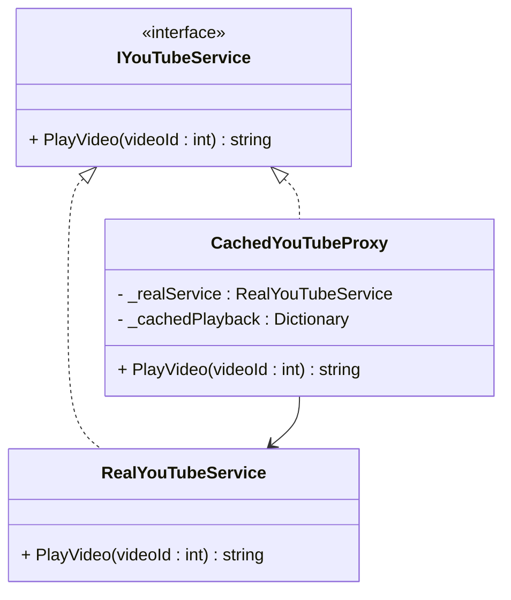

# Proxy Design Pattern

## Purpose
The proxy is a structural design pattern that uses an intermediary object to control access to another object for adding functionalities like access control, lazy initialization, logging, caching, etc.

## Steps
1. Define an interface that both the real object and the proxy will implement.
2. Implement the actual functionality in the real object by inheriting interface.
3. Create proxy class which implement the same interface but addition behavior control mechanisms before/after calling real object functionality


## Example
The ATM acts as a intermediary which handles user requests, such as cash withdrawals or balance inquiries, while the actual transactions are processed on the bank's server, effectively keeping the complex banking operations hidden.

## Cons
- The proxy may slow down performance due to extra processing (e.g., logging, security checks).

## Structure


## Code
```csharp
// Step 1: Define an Interface
public interface IYouTubeService
{
    string PlayVideo(int videoId);
}

// Step 2: Real Subject - Simulates actual YouTube API calls
public class RealYouTubeService : IYouTubeService
{
    public string PlayVideo(int videoId)
    {
        Console.WriteLine($"[YouTube API] Fetching video info and streaming Video ID: {videoId}...");
        return $"Playing Video {videoId} - Title: 'Awesome Video {videoId}', Duration: 10min";
    }
}

// Step 3: Proxy - Implements caching and logging
public class CachedYouTubeProxy : IYouTubeService
{
    private RealYouTubeService _realService;
    private Dictionary<int, string> _cachedPlayback = new Dictionary<int, string>();

    public CachedYouTubeProxy()
    {
        _realService = new RealYouTubeService();
    }

    public string PlayVideo(int videoId)
    {
        Console.WriteLine($"[Proxy] Logging video playback request for Video ID: {videoId}");

        // Check cache before calling real service
        if (_cachedPlayback.ContainsKey(videoId))
        {
            Console.WriteLine($"[Proxy] Returning cached playback for Video ID: {videoId}");
            return _cachedPlayback[videoId];
        }

        // Fetch from real service if not cached
        string playback = _realService.PlayVideo(videoId);
        _cachedPlayback[videoId] = playback;
        return playback;
    }
}
```